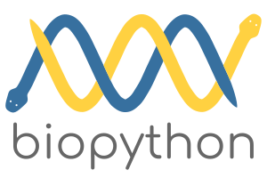
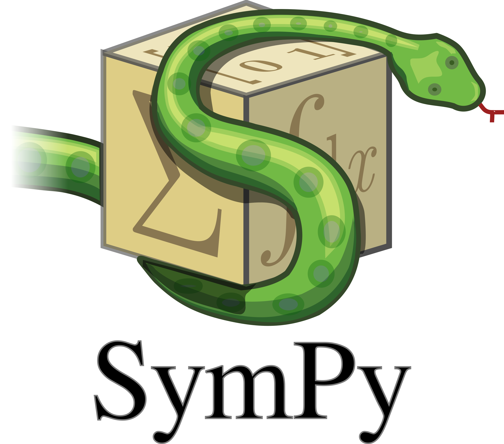

.. _`numerical_packages`:

Advanced Scientific Packages
============================

This page introduces you to a set of powerful Python libraries for advanced numerical computing. Python has libraries for machine learning, model fitting, statistics, network calculations, and much more! Here we highlight the following important scientific libraries:

- :ref:`scikit-learn` --- diverse machine learning tools
- :ref:`scikit-image` --- image analysis
- :ref:`LmFit` --- nonlinear fitting
- :ref:`Networkx` --- network analysis
- :ref:`Biopython` --- bioinformatics tools
- :ref:`emcee` --- Bayesian MCMC
- :ref:`PyMC3` --- Probabilistic programming
- :ref:`StatsModels` --- statistics
- :ref:`Astropy` ---astrophysics tools
- :ref:`Cython` --- simple C extensions
- :ref:`Numba` --- just in time compiling for Python
- :ref:`SymPy` --- executes symbolic math operations
- :ref:`TensorFlow` --- deep learning
- :ref:`Theano` --- deep learning
- :ref:`Keras` --- deep learning

.. _`scikit-learn`:

-----------------------------------------------

scikit-learn is a powerful Python library for machine learning. It contains a wide array of useful tools for classification, regression, clustering, dimensionality reduction, and much more. Implementations are available for most standard machine learning algorithms, such as Support Vector Machines and Decision Trees. If you're planning to do machine learning in Python, you'll want to install scikit-learn.

To install this library in your Python environment simply run:
::

    conda install scikit-learn

.. _`scikit-image`:

.. image:: ../_imgs/logos/scikit-image-logo.png
  :width: 200 px
  :align: center
  :target: http://scikit-image.org/
-----------------------------------------------

scikit-image is a very useful Python library for handling image data. It's a powerful tool for image processing that allows users to identify objects, filter images, manipulate color channels, and a wide variety of other tasks.

To install this library in your Python environment simply run:
::

    conda install scikit-image

.. _`LmFit`:

--------------------------------------------

LmFit is a great tool for non-linear curve fitting. It uses SciPy under-the-hood, but offers a better interface. Specifically, it offers more control when estimating model parameters. If you're going to be fitting complex data in Python, we suggest LmFit.

To install this library in your Python environment simply run:
::

    conda install lmfit

.. _`Networkx`:

--------------------------------------

Networkx offers a simple interface for managing network data. It introduces a Graph datatype that is easy and intuitive to use. It also provides various algorithms for analyzing and plotting networks.

To install this library in your Python environment simply run:
::

    conda install networkx

.. _`Biopython`:

-----------------------------------------------

Biopython is a libary built for biological computation. It contains a wide array of bioinformatics tools for handling sequence data, parsing files, searching databases, performing poulation genetics calculations, and much more.

To install this library in your Python environment simply run:
::

    conda install biopython

.. _`emcee`:

------------------------------------------------

emcee is a Python library for efficiently estimating probability distributions. It uses an efficient MCMC sampling strategy that is often used to approximate posterior distributions in Bayes Theorem. If you're looking to implement a Bayesian fit in your analysis we recommend using emcee.

To install this library in your Python environment simply run:
::

    conda install emcee

.. _`PyMC3`:

----------------------------------------

PyMC3 is another useful tool for implementing Bayesian inference in your analyses. PyMC3 is a versatile probabilistic programming framework that allows users to define probabilistic models directly in Python. Under the hood it uses a variety of clever trickes to make computations faster.

To install this library in your Python environment simply run:
::

    conda install pymc3

.. _`StatsModels`:

.. image:: ../_imgs/logos/statsmodels_hybi_banner.png
  :width: 200 px
  :align: center
  :target: https://www.statsmodels.org/stable/index.html
--------------------------------------------------------

StatsModels is a versatile statistical environment for Python. It allows users to perform a wide array of statistical tests and analyses. Various regressions are available for model fitting. It also includes tools for plotting and nonparametric statistics. If you'll be implementing a lot of statistics in Python, StatsModels will likely be useful.

To install this library in your Python environment simply run:
::

    conda install statsmodels

.. _`Astropy`:

---------------------------------------------

If you're an astrophysicist looking to use Python for your analyses, Astropy is for you. This library implements a range of methods, models, and statistics that are useful for astrophysical data.

To install this library in your Python environment simply run:
::

    conda install astropy

.. _`Cython`:

----------------------------------------

Cython is another library aimed at speeding up Python code. Users can write Python code and quickly translate it to a C extension.

To install this library in your Python environment simply run:
::

    conda install cython

.. _`Numba`:

-------------------------------------------------

Numba is a library designed to help you speed up your Python calculations. It achieves this goal using a just-in-time compiler, which gives Python code speed that is comparable in performance to C. Numba is easy to use. Python functions can be wrapped with a simple decorator that results in increased speed.

To install this library in your Python environment simply run:
::

    conda install numba

.. _`SymPy`:

---------------------------------------------

SymPy is a library for doing symbolic math. You can compute integrals, derivatives, algebraic manipulations, etc. Think Mathematica in Python.

To install this library in your Python environment simply run:
::

    conda install sympy

.. _`TensorFlow`:

.. image:: ../_imgs/logos/TensorFlowLogo.png
  :width: 200 px
  :align: center
  :target: https://www.tensorflow.org/
--------------------------------------------

TensorFlow is a versatile library designed for implementations of deep learning algorithms. If you're looking to use deep neural networks on your data, for example a large-scale image classification problem, then TensorFlow will likely be useful.

To install this library in your Python environment simply run:
::

    conda install tensorflow

.. _`Theano`:

---------------------------------------------------

Theano is a library geared toward efficient computations on multidimensional arrays. It also supports implementation of code on GPUs. Theano is useful for implementing deep learning in Python.

To install this library in your Python environment simply run:
::

    conda install theano

.. _`Keras`:

----------------------------------------

Keras is another Python library for machine learning using neural networks. It is capable of interacting with other machine learning libraries, including TensorFlow and Theano. Keras runs on CPUs and GPUs and is designed for fast implementation of neural networks.

To install this library in your Python environment simply run:
::

    conda install keras
