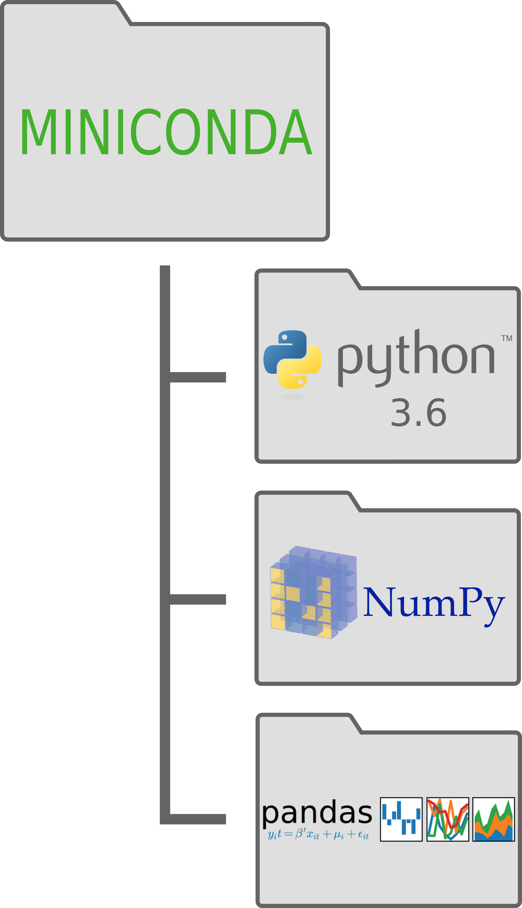

.. _`environments`:

Virtual Environments
====================

1. `Default Conda Environment`_
2. `Creating a Python 2.7 Environment`_
3. `Creating a TensorFlow Environment`_
4. `Creating and using a Development Environment`_

.. _`Default Conda Environment`:

1. Default Conda Environment
----------------------------

Here is a graphical representation of what you have when you start out using conda:

 
This is your default python environment.
It uses python 3.6 and has any packages that we've installed using either the 
`pip` or `conda` commands.

.. _`Creating a Python 2.7 Environment`:

2. Creating a Python 2.7 Environment
------------------------------------

This is all well and good but what if you need to use python 2.7 for a particular
application or problem? 
This is an excellent opportunity to use a **virtual environment** in conda.
A virtual environment creates a copy of your miniconda environment with a 
specific python version and only the packages you want.

This is how you make a virtual environment using conda:

::

  conda create -n python2 python=2.7 matplotlib pandas
   
The field after `-n` is the name of your environment, the `python=` flag is 
where you specify your python version, and you can add package names that you
already have installed in your default miniconda.

Here is the result of creating our python 2.7 virtual environment:

.. image:: ../_imgs/environments_folders-2.png
  :scale: 8 %
  :align: left

In order to use this environment you will have to activate it:

::

   # Old conda
   source activate python2
   
   # New conda
   conda activate python2
   
And when you want to switch back to your default:

::

   # Old conda
   source deactivate

   # New conda
   conda deactivate
   

.. _`Creating a TensorFlow Environment`:

3. Creating a TensorFlow Environment
------------------------------------

Now say that you want to install TensorFlow but you don't want to accidentally
kill your default python by installing it or you want to make sure that you can
easily uninstall it later. A virtual environment is great for this too.

::

  conda create -n Tensorflow python=3.6 numpy
  
Now activate the environment

::

  conda activate Tensorflow

Then install tensorflow

::

  pip install tensorflow
  
Now you're available environments will look like this:

.. image:: ../_imgs/environments_folders-3.png
  :scale: 8 %
  :align: left

.. _`Creating and using a Development Environment`:

4. Creating and using a Development Environment
-----------------------------------------------

One more reason that you might want a virtual environment is for developing your
own packages. Say you've got a package called test that you want to test out as
you develop it. Make a virtual environment with the packages you need and then 
install your package with pip in editable mode.

::

  # Create the environment
  conda create -n Test python=3.6 pandas matplotlib
  
  # Activate this new environment
  conda activate Test
  
  # Then install your local package
  pip install -e /path/to/your/package/test

Now your available environments will include your test development environment. 

