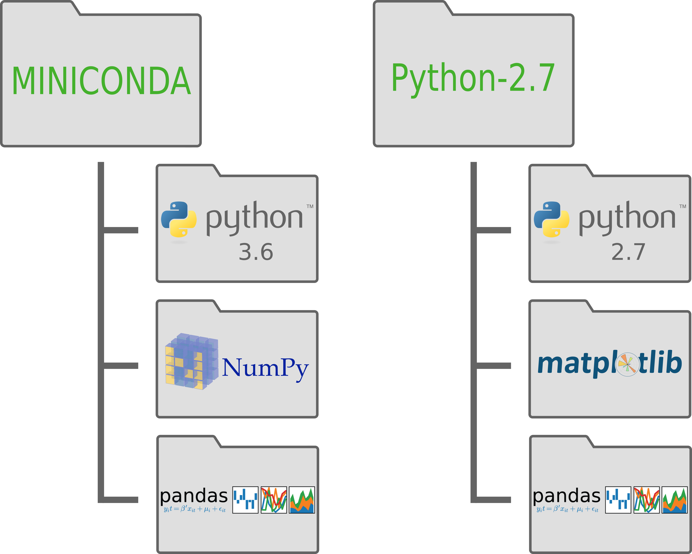

.. _`environments`:

Virtual Environments
====================

Here is a graphical representation of what you have when you start out using conda:

.. image:: ../_imgs/environments_folders-1.png
  :scale: 50 %
  :align: center

This is your default python environment.
It uses python 3.6 and has any packages that we've installed using either the
`pip` or `conda` commands.

This is all well and good, but what if, for example, you need to use python 2.7 for a particular
application or problem?
This is an excellent opportunity to use a **virtual environment** in conda.
A virtual environment creates a copy of your miniconda environment with a
specific python version and **only** the packages you want.

This is how you make a virtual environment using conda:

::

  conda create -n python2 python=2.7 matplotlib pandas

The field after `-n` is the name of your environment, the `python=` flag is
where you specify your python version, and you can add package names that you
already have installed in your default miniconda.

Here is the result of creating our python 2.7 virtual environment:

In order to use this environment you will have to activate it:

::

   # Old conda
   source activate python2

   # New conda
   conda activate python2

And when you want to switch back to your default:

::

   # Old conda
   source deactivate

   # New conda
   conda deactivate

1. `Set up a new virtual environment using conda`_

.. _`Set up a new virtual environment using conda`:

1. Set up a new virtual environment using conda
-----------------------------------------------

.. image:: ../_imgs/miniconda.png
  :scale: 17 %
  :align: right

As an example I want to make an environment called "master-blaster" that uses
python 3.6 and has ``numpy``, ``pandas``, and ``matplotlib`` preinstalled::

   conda create -n master-blaster python=3.6 numpy pandas matplotlib ipykernel

Why did I add ``ipykernel`` to the package list? That's so we can make an
ipython kernel in the next step!

Making an ipython kernel
------------------------

::

   source activate master-blaster
   python -m ipykernel install --user --name master-blaster --display-name "Python 3 (master-blaster)"

Now this kernel can be used in a Jupyter notebook without having to activate the
associated virtual environment.

What is a virtual environment?
------------------------------
A virtual environment is a self-contained version of Python and specified
packages. When you switch to a different virtual environment conda points to
that python installation and installed packages. A package installed globally
but not in that virtual environment won't show up.

What is a kernel?
-----------------
A kernel is the engine that actually runs your code. Using Jupyter you can have
a kernel for each virtual environment and even kernels for languages other than
Python.

Why would you want a virtual environment?
-----------------------------------------
Virtual environments are a good way to protect yourself. Say you accidentally
install or delete something, if you're in a virtual environment you can delete
it and start over without reinstalling Python.
