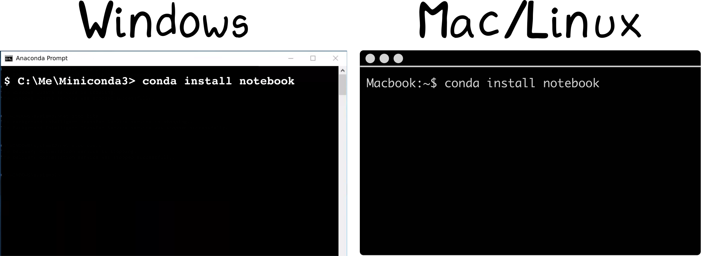
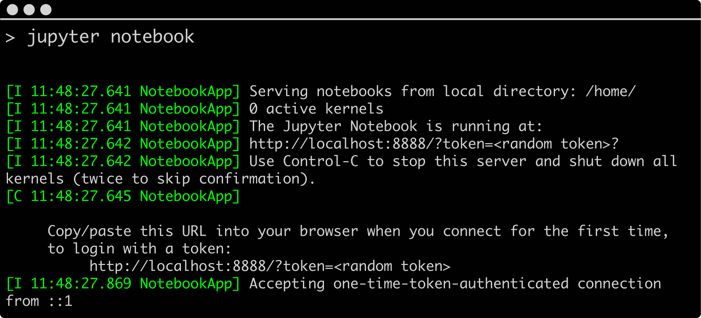

4 steps to start
================

1. `Install Python using Miniconda`_
2. `Install the Jupyter Notebook`_
3. `Install core scientific packages`_
4. `Run the Jupyter Notebook`_

.. _`Install Python using Miniconda`:

1. Install Python using Miniconda
---------------------------------

We recommend Miniconda_ (`even if you have Python already installed`_).

.. _Miniconda: https://conda.io/miniconda.html

Miniconda installers contains Python and the Conda_ package manager. Installers_ exist for Windows, Mac, and Linux. Download the installer that matches your operating system and follow the directions to install miniconda on your computer. (`Should I install Python 2 or 3`_?)

Once installed, Miniconda becomes a folder that contains everything Python and Conda related. If anything ever goes wrong with your Python setup, you can always remove the Miniconda folder and start over.

.. _Conda: https://conda.io/docs/
.. _Installers: https://conda.io/miniconda.html

Conda will be your main tool for installing Python packages moving forward. It installs packages through a mechanism known as *conda-recipes*. (It's important to note, it can do `many other`_ things as well.) Conda also manages package updates and creates virtual environments.

*pip* is another tool for installing Python packages (and comes with Miniconda). If a conda-recipe does not exist for a package, you can try installing using pip.

.. _`Install the Jupyter Notebook`:

2. Install the Jupyter Notebook.
--------------------------------

To install new Python packages using Conda, you'll want to need use a `command line interface`_.

.. _`command line interface`: https://en.wikipedia.org/wiki/Command-line_interface

**On Windows**, use your new **Anaconda prompt** application installed by Miniconda.

**On Mac and Linux**, use the **Terminal** application.

Using your new *conda* tool, install the Jupyter Notebook. The commands looks like:

.. code-block:: bash

  > conda install notebook

In general, you'll type ``conda install some_package_name`` to install new packages. If a package cannot be installed from conda, try using **pip**.

.. code-block:: bash

  # Installing with conda
  > conda install some_package_name

  # Installing with pip
  > pip install some_package_name

.. _`Install core scientific packages`:

3. Install core scientific packages
-----------------------------------

.. image:: ../_imgs/notebook.png
  :scale: 37%
  :align: right

Before you run a Jupyter notebook, you'll want to install a few core scientific packages. These packages allow you to awesome notebooks like the one show to the right.

- Matplotlib_ is Python's most popular plotting package.
- Numpy_ and SciPy_ are Python's fundamental packages for scientific computing.

.. _Matplotlib: https://matplotlib.org/
.. _Numpy: http://www.numpy.org/
.. _SciPy: https://www.scipy.org/

.. code-block:: bash

  > conda install numpy scipy matplotlib

A more comprehensible list of Python packages for scientific computing can be found here_.

.. _here: advanced_numerical.html

.. _`Run the Jupyter Notebook`:

4. Run the Jupyter Notebook
---------------------------
Open Jupyter Notebooks using a command line interface (why_?). Run the following command on the command line:

.. code-block:: bash

  > jupyter notebook

Your output on the command line may look something like this:

And the notebook application will launch in a browser window.
