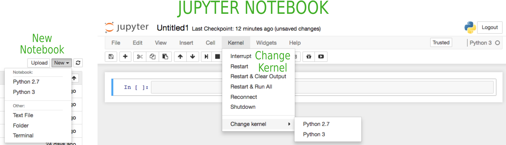
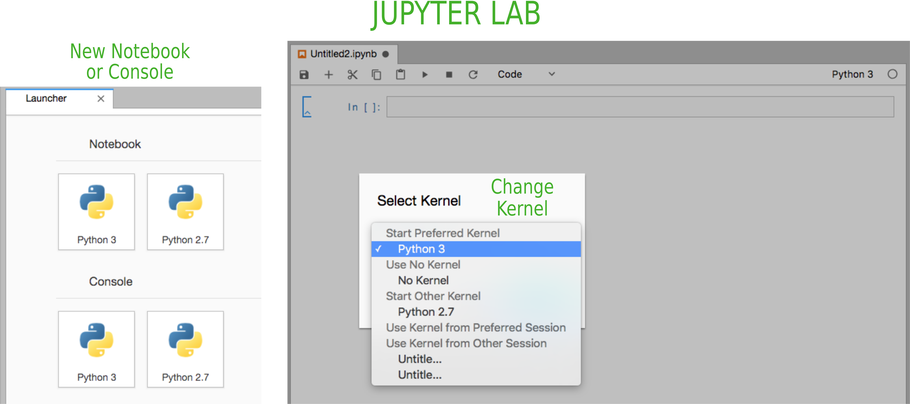

ipython Kernels
===============

1. `Going from virtual environments to kernels`_
2. `Making an ipython kernel`_

.. _`Going from virtual environments to kernels`:

1. Going from virtual environments to kernels
---------------------------------------------

Virtual environments are a nice way to compartmentalize your coding environment
but you can't make use of them in a jupyter notebook automatically.

What we need to do is make a kernel that is associated with each virtual
environment. `What is a kernel?`_

The cool thing is that once we make a kernel you don't have to change virtual
environments to use them in the jupyter notebook!

.. _`Making an ipython kernel`:

2. Making an ipython kernel
---------------------------

::

   # Activate your virtual environment
   source activate Python-2.7

   # Install ipykernel
   pip install ipykernel

   # Create your ipykernel
   python -m ipykernel install --user --name Python-2.7 --display-name "Python 2.7"

Now this kernel can be used in a jupyter notebook or jupyter lab without having to activate the
associated virtual environment.

And this reflects our available virtual environments that we set up before.

.. image:: ../_imgs/environments_folders-2.png
  :scale: 8%
  :align: right

What is a kernel?
-----------------
A kernel is the engine that actually runs your code. Using Jupyter you can have
a kernel for each virtual environment and even kernels for languages other than
Python.
