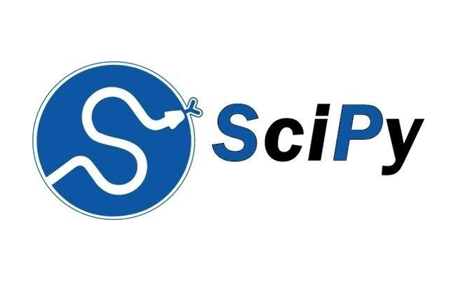

Core Scientific Packages
========================

This section introduces you to the core numerical libraries in Python. These libraries are essential for scientific computing in a Python environment.

-----------------------------------

NumPy introduces arrays to python. Numpy arrays are an essential tool for scientific computing in Python. Arrays are an efficient way to perform computations on large datasets. A wide variety of functions for manipulating arrays and performing linear algebra calculations are included in NumPy.

To install NumPy in your python environment simply run:

::

    conda install numpy

----------------------------------------

SciPy contains a broad range of useful tools for scientific computing including optimization functions, mathematical transforms, distance calculations, statistical tools, and image processing applications.

To install SciPy in your python environment simply run:

::

    conda install scipy

-----------------------------------------

Pandas brings the feel of spreadsheets to your python computing environment! Pandas provides powerful, easy-to-use data structures and analysis tools to help you handle your datasets. Pandas makes importing, navigating, and manipulating datasets easy!

To install pandas in your python environment simply run:

::

    conda install pandas
